# Path Anisotropy Curvature

This repository develops a graph-based curvature diagnostic inspired by geodesic shells, shortest-path statistics, and continuum curvature invariants such as the Schwarzschild Kretschmann scalar.

The project began as an exploratory Wolfram Community / Wolfram Summer School idea about a possible Kretschmann-like scalar for hypergraphs. This repository reformulates the idea more cautiously as a discrete curvature diagnostic based on shortest-path anisotropy.

The current goal is not to claim that the estimator is already a discrete Kretschmann scalar. Instead, the goal is to test whether local shortest-path anisotropy contains curvature-like information in graph discretizations of known continuum geometries.

## TL;DR

This project tests whether local shortest-path anisotropy can act as a curvature-sensitive observable in graph discretizations of continuum geometries.

The strongest current result is obtained in a Flamm / Schwarzschild benchmark. For graph radius $r_g = 3$, the rank correlation between the logarithmic path-anisotropy estimator and the Schwarzschild Kretschmann scalar improves with graph refinement.

|    N | Mean Spearman | Std. Spearman |
| ---: | ------------: | ------------: |
|  200 |        0.5320 |        0.1364 |
|  500 |        0.5630 |        0.0761 |
| 1000 |        0.6636 |        0.0469 |

After radial binning, the estimator shows a strong relation with the logarithmic Schwarzschild curvature profile:

$$
\mathrm{Corr}(\log K_{\mathrm{Schw}}, C_{\log}) \approx 0.912.
$$

A matched-flat control was also added. This control uses the same radial sampling as the Flamm graph but removes the Flamm height profile. Across five random seeds at $N=1000$, graph radius $r_g=3$, and $k=16$, the matched-flat control gives

$$
\mathrm{Corr}(r,C_{\log})_{\mathrm{MatchedFlat}} = 0.180 \pm 0.315,
$$

whereas the Flamm / Schwarzschild benchmark gives

$$
\mathrm{Corr}(r,C_{\log})_{\mathrm{Flamm}} = -0.960 \pm 0.015.
$$

The result also survives changes in the $k$-nearest-neighbor graph construction. Across $k=12,14,16,18,20$, the Flamm / Schwarzschild benchmark remains strongly negatively correlated with radial coordinate, while the matched-flat control remains weak or variable.

Secondary paraboloid and hyperbolic-paraboloid tests are included as sensitivity benchmarks. These show that the estimator is affected by curvature strength, radial sampling, and graph construction, so matched-flat controls are essential.

The current interpretation is that $C_{\log}$ tracks the **spatial organization of curvature-sensitive graph structure** rather than directly reproducing a continuum curvature scalar point by point.

## Core idea

Given a graph $G$, a center vertex $p$, and a graph-distance radius $r_g$, define the graph-distance ball

$$
B_{r_g}(p) = { q \in G \mid d(p,q) \le r_g },
$$

and the graph-distance shell

$$
S_{r_g}(p) = { q \in G \mid d(p,q) = r_g }.
$$

The ball contains all vertices within $r_g$ graph steps of $p$. The shell is only the boundary layer: the vertices exactly $r_g$ graph steps away.

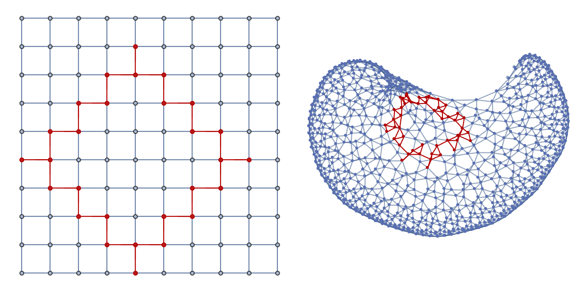

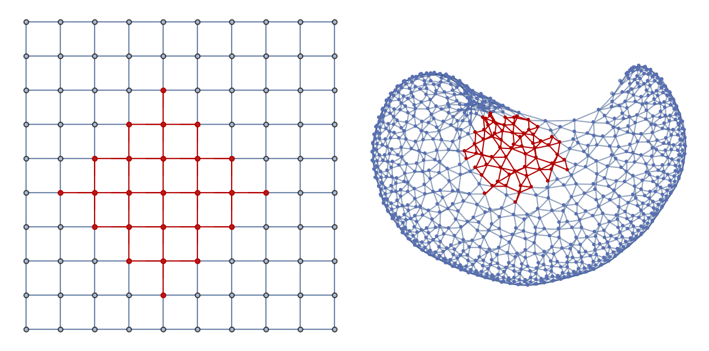

For each shell vertex $q$, count the number of shortest paths from $p$ to $q$:

$$
N_{\mathrm{geo}}(p,q)
$$

or, more explicitly, $N_{\mathrm{geo}}(p,q)$ denotes the number of distinct shortest paths from $p$ to $q$.

The estimator measures how uneven these shortest-path counts are across the shell. The working hypothesis is that curvature leaves a statistical signature in the local geodesic/path structure of a discretized manifold.

The current main estimator is the logarithmic cubic-mean-deviation version:

$$
C_{\log}(p, r_g) = \mathrm{CMD}*{q \in S*{r_g}(p)} \big( \log N_{\mathrm{geo}}(p,q) \big).
$$

This should be understood as a **curvature-sensitive diagnostic**, not yet as a rigorously derived discrete curvature invariant.

## Method at a glance

For each center vertex $p$:

1. Build the graph-distance shell $S_{r_g}(p)$.
2. Count the number of shortest paths $N_{\mathrm{geo}}(p,q)$ from $p$ to each shell vertex $q$.
3. Compute the variation of $\log N_{\mathrm{geo}}(p,q)$ over the shell.
4. Compare the resulting local estimator $C_{\log}(p,r_g)$ with a continuum curvature target or with a control geometry.

In Mathematica, the main estimator is stored as the `LogCMD` column.

## Benchmark geometries

The repository includes simple benchmark graph discretizations, including a flat control, a hyperboloid-like surface, a paraboloid, a hyperbolic paraboloid, and a Flamm paraboloid / Schwarzschild spatial-slice-inspired graph.

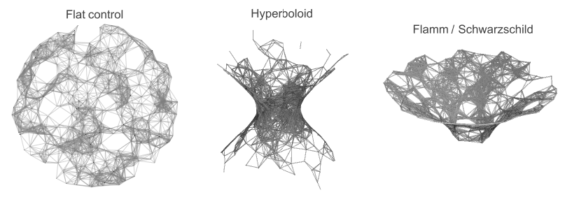

The main benchmark is the Flamm / Schwarzschild case. The continuum comparison target is the Schwarzschild Kretschmann scalar

$$
K_{\mathrm{Schw}} = \frac{48 M^2}{r^6}.
$$

The repository tests whether the graph estimator correlates with this radial curvature profile.

## Current preliminary results

Current exploratory Mathematica runs show:

|    N | graph radius | Mean Pearson | Mean Spearman | Std. Spearman |
| ---: | -----------: | -----------: | ------------: | ------------: |
|  200 |            3 |       0.1781 |        0.5320 |        0.1364 |
|  200 |            4 |       0.1134 |        0.3346 |        0.1661 |
|  500 |            3 |       0.1773 |        0.5630 |        0.0761 |
|  500 |            4 |       0.1666 |        0.5023 |        0.0679 |
| 1000 |            3 |       0.2460 |        0.6636 |        0.0469 |
| 1000 |            4 |       0.2496 |        0.6274 |        0.0553 |

The signal strengthens and becomes less seed-dependent as graph resolution increases.

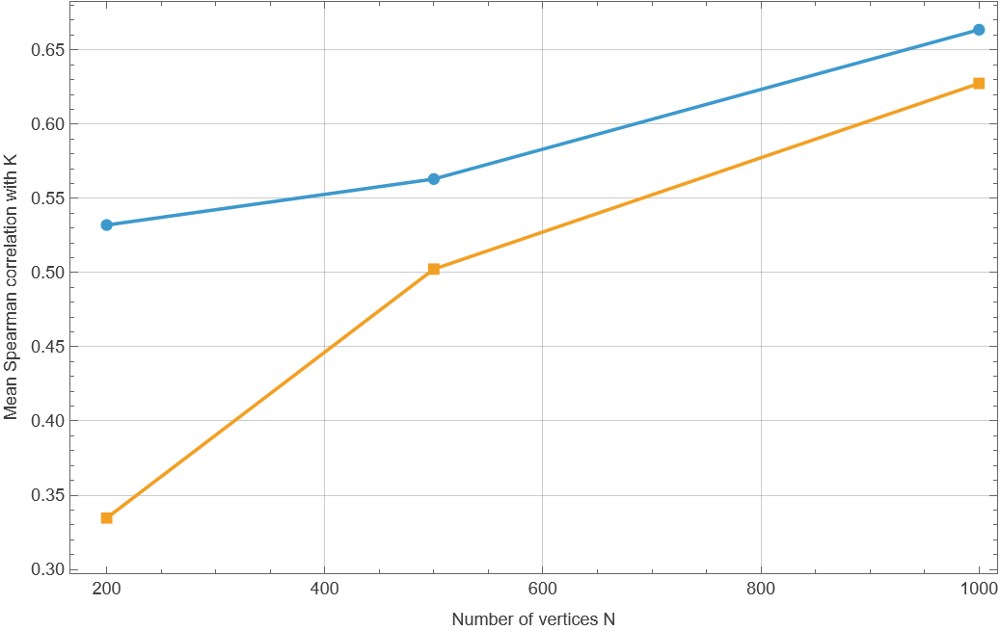

The standard deviation across random seeds decreases as $N$ increases, suggesting improved stability under graph refinement.

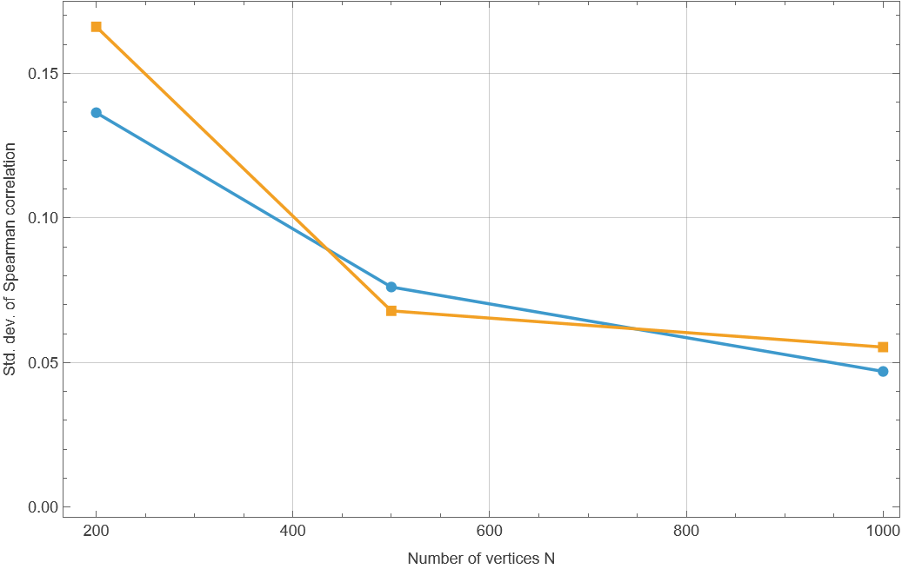

## Radial binning

The raw vertex-level comparison is noisy because the estimator is local and the graph is randomly sprinkled. Since the Schwarzschild Kretschmann scalar depends only on radial coordinate,

$$
K_{\mathrm{Schw}} = \frac{48 M^2}{r^6},
$$

a more physically meaningful comparison is obtained by binning vertices by radial coordinate and averaging the estimator inside each radial bin.

For $N=500$, graph radius $r_g = 3$, and 12 radial bins, the binned logarithmic path-anisotropy estimator shows a strong relation with the Schwarzschild curvature profile. In the current run,

$$
\mathrm{Corr}(\log K_{\mathrm{Schw}}, C_{\log}) \approx 0.912,
$$

and the Spearman rank correlation with $K_{\mathrm{Schw}}$ is approximately

$$
\rho_{\mathrm{Spearman}} \approx 0.874.
$$

This suggests that radial binning reveals a clearer curvature profile than the raw vertex-by-vertex comparison.

### Binned estimator vs log curvature

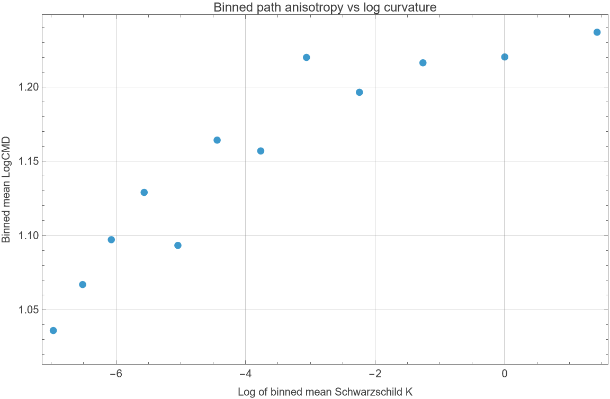

### Binned estimator vs radial coordinate

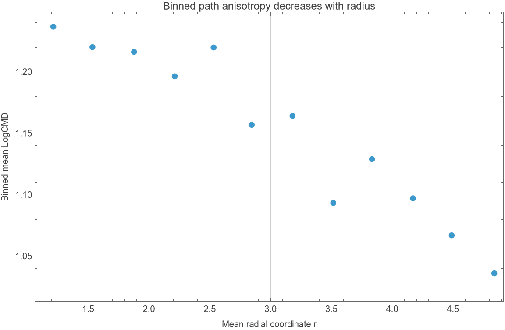

## Flat-space control

A basic flat-space control was added to check whether the estimator simply produces a different global distribution in curved and flat graphs. The global distributions of `LogCMD` overlap strongly: the Cohen $d$ effect size is

$$
d_{\mathrm{Cohen}} \approx -0.027.
$$

This indicates that the relevant signal is not a simple global shift in the estimator. In other words, the estimator does not merely say that curved graphs have larger or smaller average `LogCMD` values.

The more meaningful comparison is radial. In the flat benchmark, the radial correlation between binned mean `LogCMD` and radial coordinate is close to zero,

$$
\mathrm{Corr}(r,C_{\log})_{\mathrm{Flat}} \approx 0.046,
$$

whereas in the Flamm / Schwarzschild benchmark the radial correlation is strongly negative,

$$
\mathrm{Corr}(r,C_{\log})_{\mathrm{Flamm}} \approx -0.957.
$$

This supports the interpretation that the estimator is sensitive to the spatial organization of the curvature profile rather than merely separating flat and curved graphs by their average value.

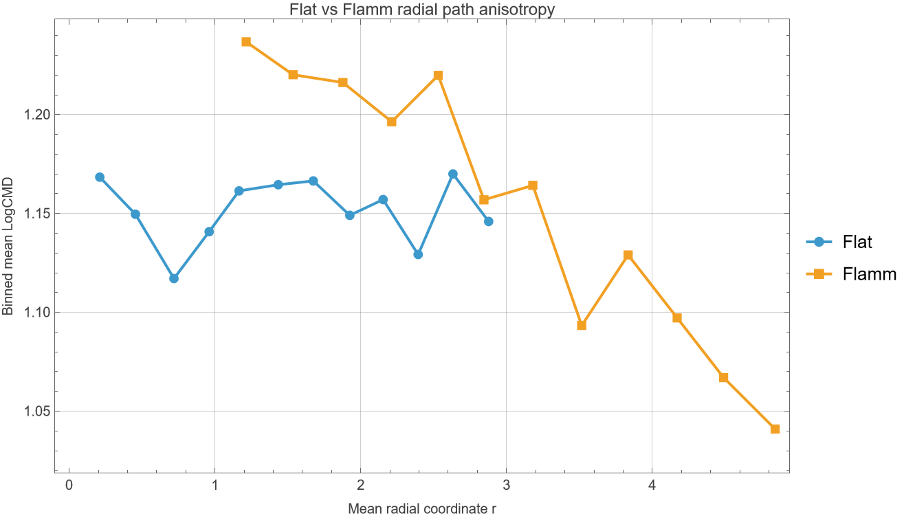

However, finite flat-disk controls can still contain boundary and graph-construction effects. For this reason, the matched-flat control below is the stronger null test.

## Matched-flat control

A stronger null test was performed using a matched-flat control. This graph uses the same radial and angular sampling as the Flamm / Schwarzschild benchmark, but removes the embedded height profile. In the Flamm benchmark, vertices are placed at

$$
(r\cos\theta, r\sin\theta, z(r))
$$

whereas in the matched-flat control they are placed at

$$
(r\cos\theta, r\sin\theta).
$$

This keeps the radial sampling fixed while removing the Flamm curvature.

For $N=1000$, graph radius $r_g=3$, and 12 radial bins, the matched-flat control gives

$$
\mathrm{Corr}(r,C_{\log})_{\mathrm{MatchedFlat}} \approx 0.375,
$$

whereas the Flamm / Schwarzschild benchmark gives

$$
\mathrm{Corr}(r,C_{\log})_{\mathrm{Flamm}} \approx -0.985.
$$

Thus, the strong negative radial trend observed in the Flamm benchmark is not reproduced by a flat graph with the same radial sampling. This supports the interpretation that the Flamm signal is associated with the curved embedding / Schwarzschild radial curvature profile, not with the radial sampling alone.


## Matched-flat control across seeds

The matched-flat control was repeated across five random seeds at $N=1000$, graph radius $r_g=3$, $k=16$, and 12 radial bins.

| Case         | Mean Corr$(r,C_{\log})$ | Std. Corr$(r,C_{\log})$ |    Min |    Max |
| ------------ | ----------------------: | ----------------------: | -----: | -----: |
| Matched flat |                   0.180 |                   0.315 | -0.200 |  0.556 |
| Flamm        |                  -0.960 |                   0.015 | -0.983 | -0.947 |

The Flamm / Schwarzschild benchmark shows a stable strong negative radial correlation across seeds, while the matched-flat control is variable and not consistently negative. This is the current strongest control result.

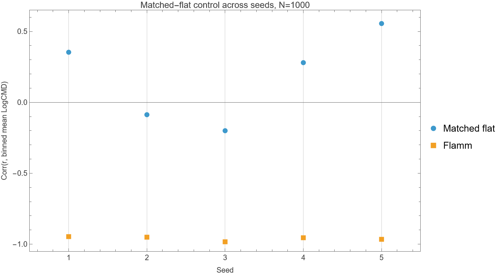

The summary figure shows the mean and standard deviation over seeds:

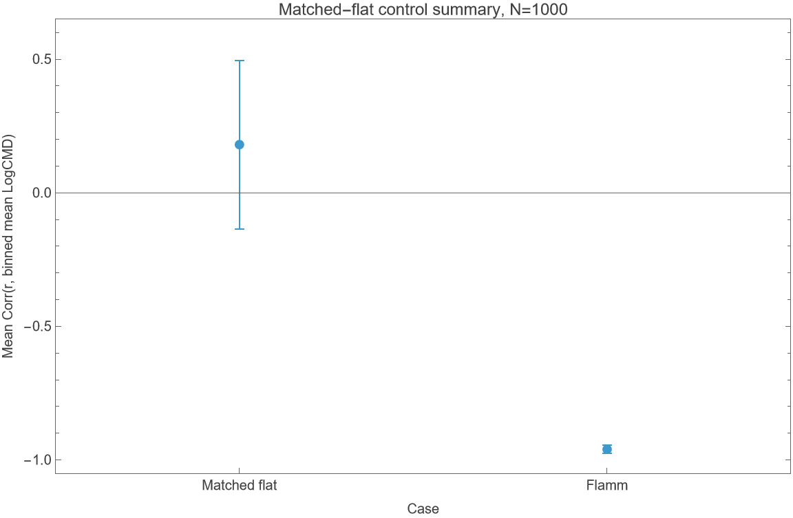

## k-sensitivity

The matched-flat control was also tested across several $k$-nearest-neighbor graph constructions. This checks whether the Flamm signal only appears for a special choice of graph connectivity.

For $N=1000$, graph radius $r_g=3$, 12 radial bins, and three random seeds per value of $k$, the mean radial correlations are:

| $k$ | Matched-flat mean | Matched-flat std | Flamm mean | Flamm std |
| --: | ----------------: | ---------------: | ---------: | --------: |
|  12 |             0.125 |            0.330 |     -0.942 |     0.016 |
|  14 |             0.155 |            0.510 |     -0.961 |     0.027 |
|  16 |             0.022 |            0.292 |     -0.960 |     0.020 |
|  18 |             0.165 |            0.413 |     -0.965 |     0.018 |
|  20 |             0.372 |            0.166 |     -0.962 |     0.023 |

Across all tested values of $k$, the Flamm / Schwarzschild benchmark remains strongly negatively correlated with radial coordinate, while the matched-flat control remains weak or variable. This suggests that the Flamm radial signal is robust to changes in the nearest-neighbor graph construction.

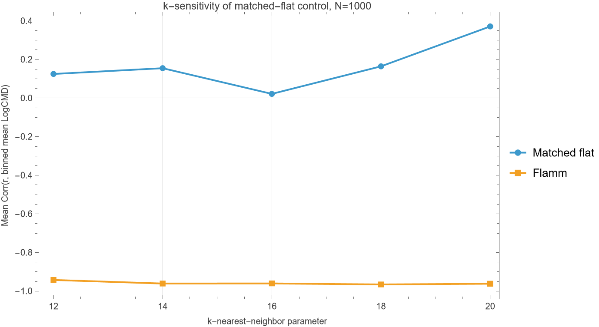

A version with error bars is also provided:

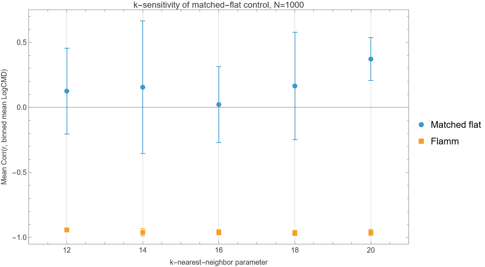

## Flamm paraboloid colored by the path-anisotropy estimator

The Flamm / Schwarzschild benchmark can also be visualized by coloring each graph vertex according to the local estimator value

$$
C_{\log}(p,r_g)
===============

\mathrm{CMD}*{q\in S*{r_g}(p)}
\big(
\log N_{\mathrm{geo}}(p,q)
\big).
$$

In these figures, the color does not show the analytic curvature directly. Instead, it shows the value of the path-anisotropy estimator computed at each vertex from a graph-distance shell centered at that vertex. The edges show the underlying nearest-neighbor graph used to compute graph distances and shortest-path multiplicities.

The $r_g=3$ visualization corresponds to the graph radius used in the main quantitative benchmark:

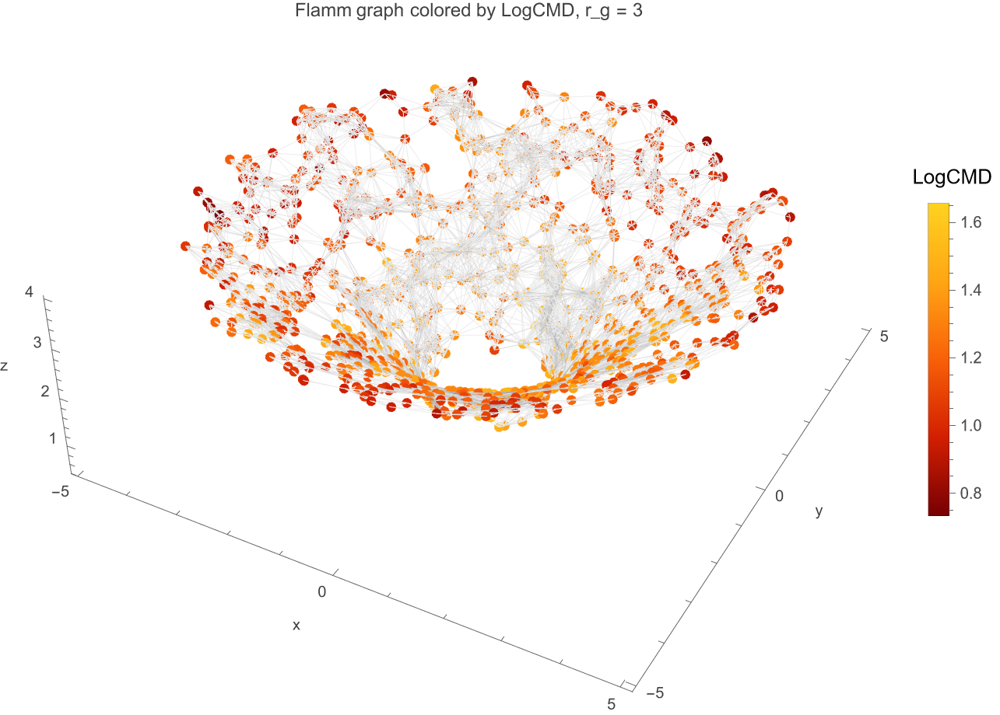

A smoother qualitative visualization using a larger graph shell radius is also provided:

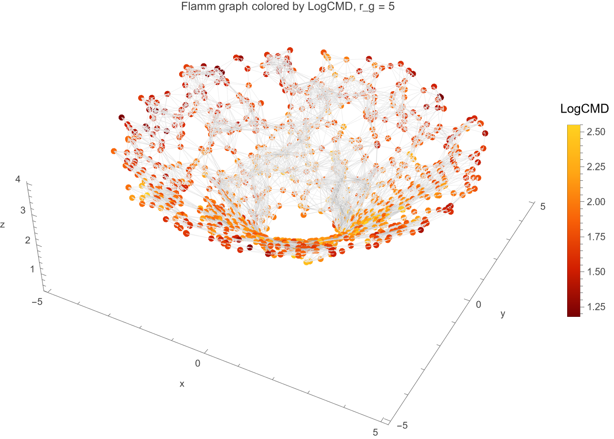

Hybrid mesh-graph versions are also included:


## Paraboloid curvature-strength scan

As a secondary benchmark, the repository also tests a paraboloid surface,

$$
z = a(x^2+y^2),
$$

or, equivalently,

$$
z = ar^2.
$$

The Gaussian curvature of this surface is

$$
K_G(r) = \frac{4a^2}{(1+4a^2r^2)^2}.
$$

This benchmark is useful because the curvature strength can be controlled directly by changing the parameter $a$.

Unlike the Flamm / Schwarzschild benchmark, the paraboloid also shows a strong radial trend in the matched-flat control. This means that radial sampling and graph construction can contribute significantly to the path-anisotropy signal. For this reason, the paraboloid benchmark should not be interpreted as a direct pointwise recovery of Gaussian curvature.

However, the curvature-strength scan shows that increasing $a$ systematically changes the path-anisotropy response relative to the matched-flat baseline. In the current scan, the matched-flat radial correlation remains approximately constant, while the paraboloid radial correlation decreases as the curvature parameter increases.

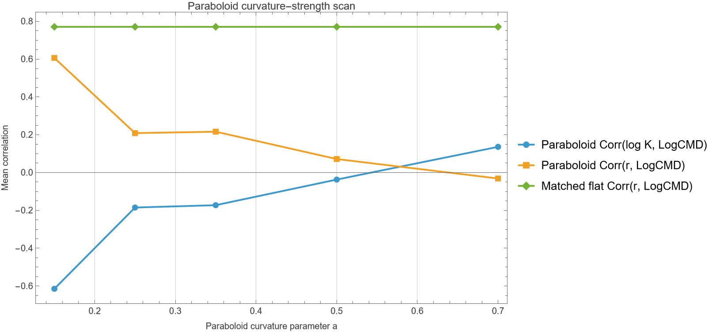

This suggests that the estimator responds to curvature strength in a nontrivial but graph-dependent way. The paraboloid benchmark therefore serves as a useful sensitivity and limitation test: it shows that matched-flat controls are essential, and that the estimator should be interpreted as a curvature-sensitive graph diagnostic rather than a universal discrete curvature scalar.

The paraboloid can also be visualized by coloring the graph vertices according to the estimator value:

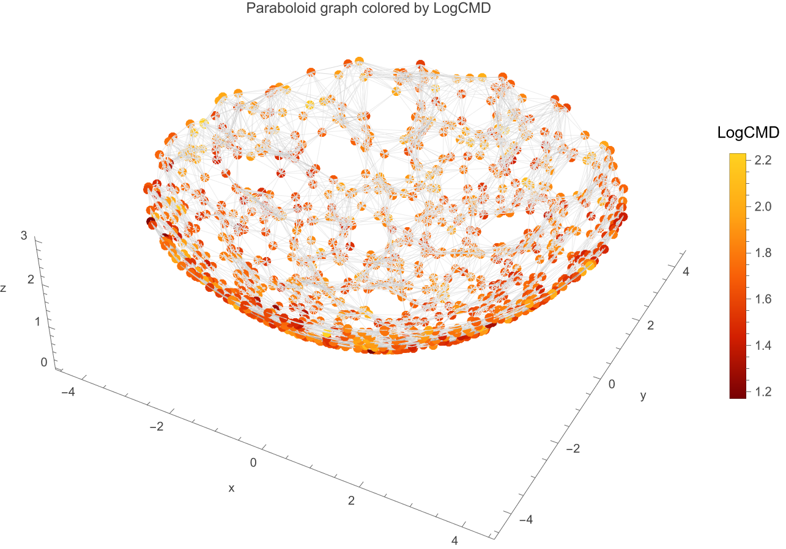

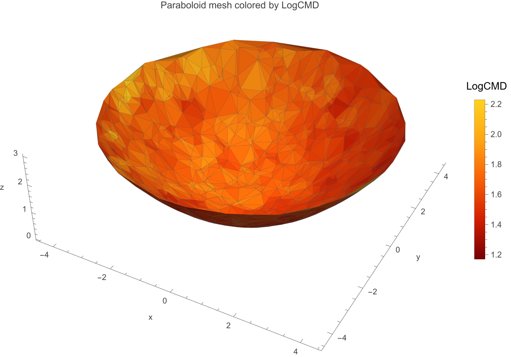

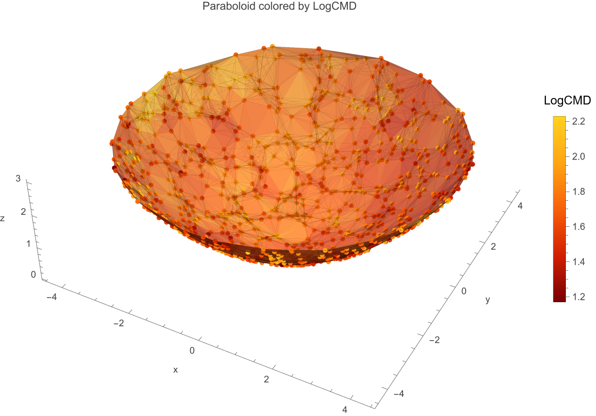

## Hyperbolic paraboloid benchmark

The repository also includes a hyperbolic paraboloid benchmark,

$$
z = a(x^2-y^2),
$$

which provides a simple negative-curvature surface. Its Gaussian curvature is

$$
K_G(x,y)
========

\frac{-4a^2}{(1+4a^2(x^2+y^2))^2}.
$$

Since this curvature is negative, comparisons are made using the curvature magnitude $|K_G|$ when logarithms are taken:

$$
\log |K_G|.
$$

This benchmark is included to test whether the path-anisotropy estimator responds differently to a saddle-shaped negative-curvature surface.

A first radial comparison shows the hyperbolic paraboloid against its matched-flat control:

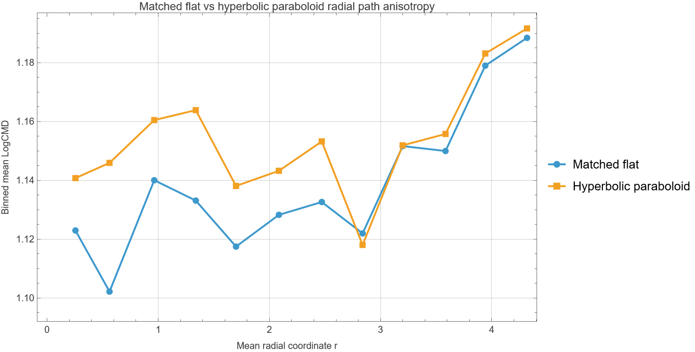

The estimator can also be compared against the logarithm of the curvature magnitude:

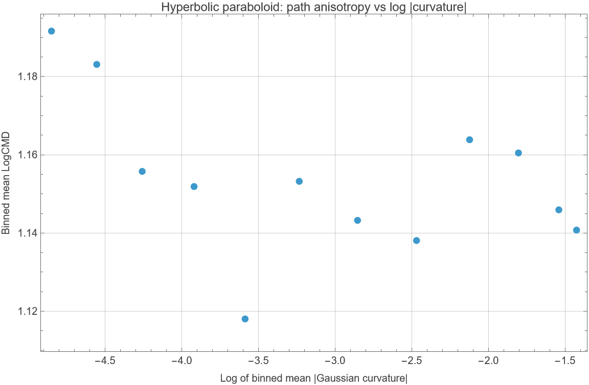

and against radial coordinate:

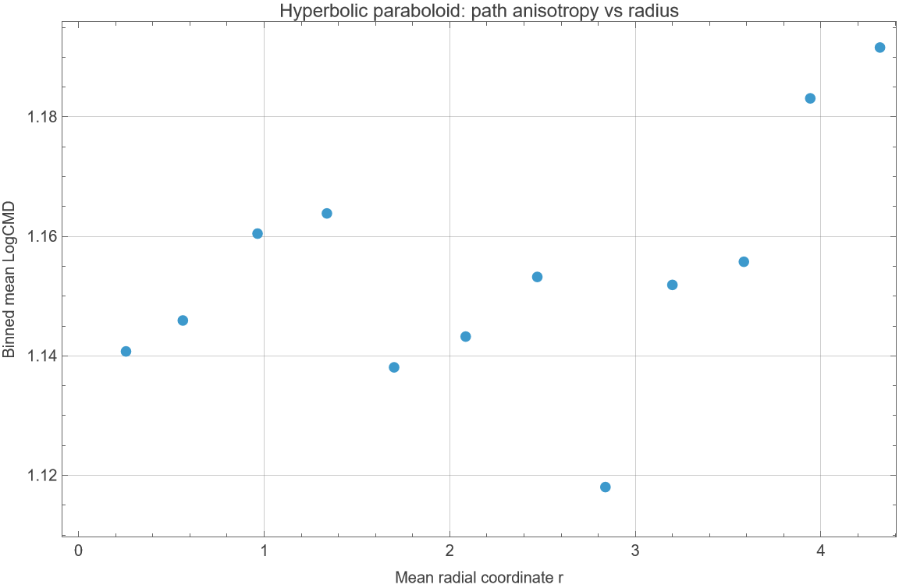

Estimator-colored visualizations are also included:


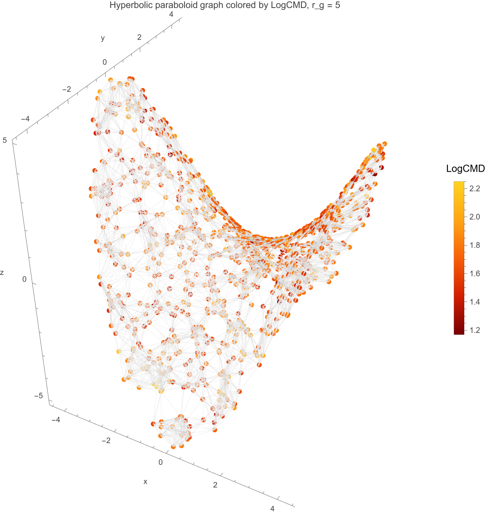

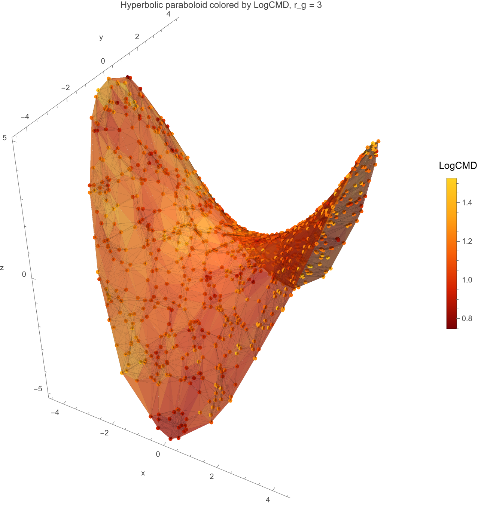

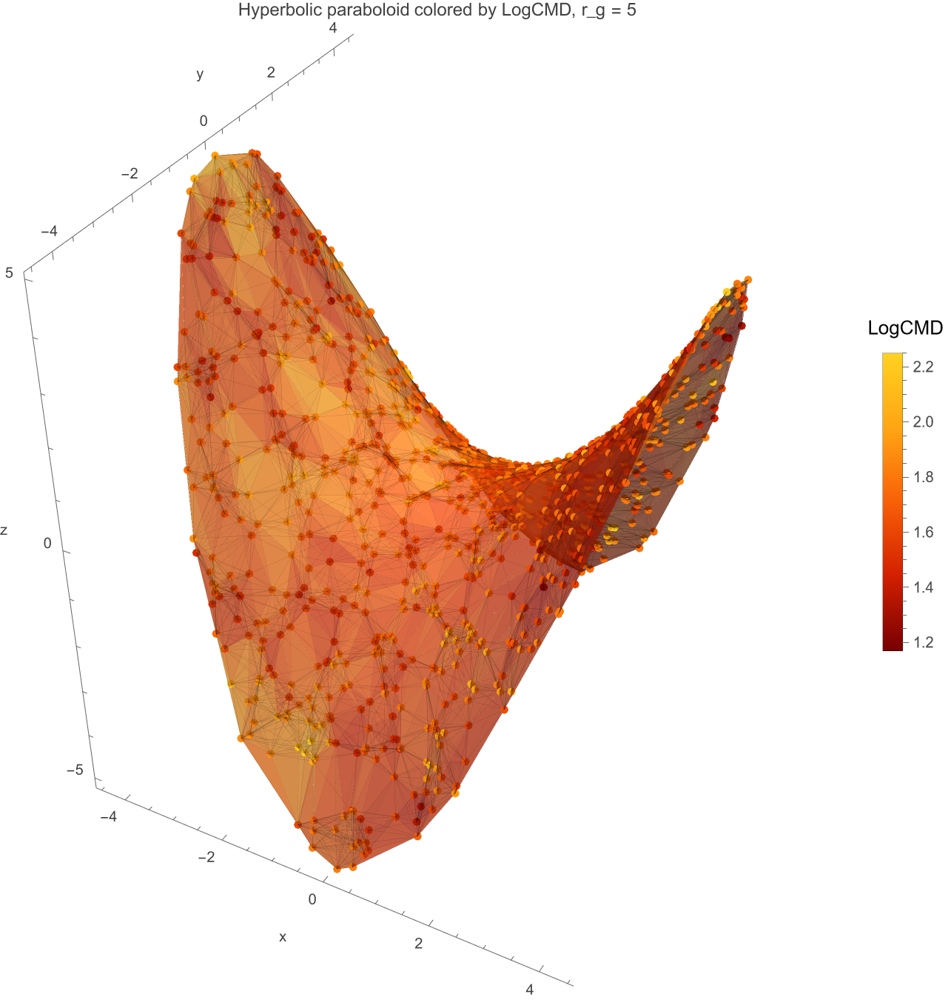

A curvature-strength scan is being used to test whether the hyperbolic paraboloid separates from its matched-flat control as the parameter $a$ is increased:

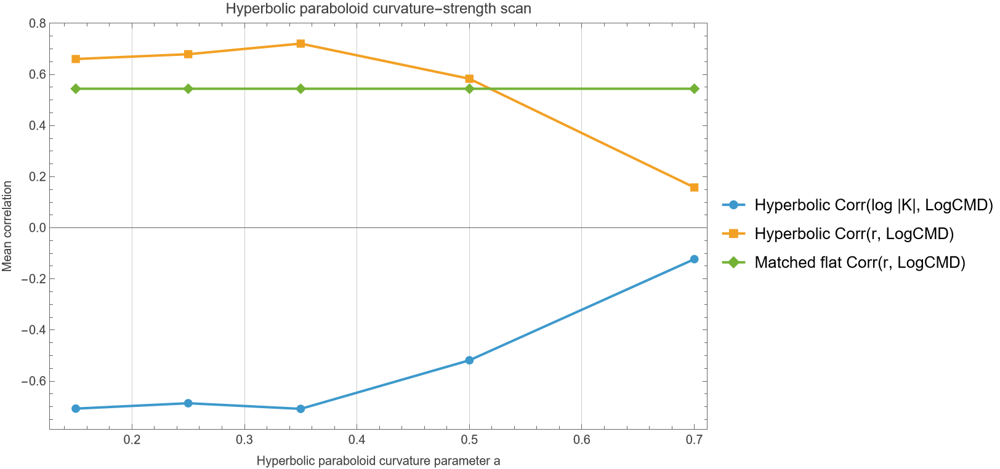

The hyperbolic paraboloid benchmark is currently exploratory. Its purpose is to test the graph-construction dependence of the estimator beyond the Flamm / Schwarzschild case and to evaluate whether negative curvature produces a distinguishable path-anisotropy response.

## Repository structure

```text
.
├── code/
│   └── CurvatureEstimator.wl
├── docs/
│   ├── paper_notes.md
│   ├── paper_notes.tex
│   └── quickstart.md
├── notebooks/
│   └── README.md
├── results/
│   ├── figures/
│   └── tables/
├── .gitignore
├── LICENSE
└── README.md
```

## Quick start

Open Mathematica and run:

```wolfram
Get["code/CurvatureEstimator.wl"];

SeedRandom[1234];

flamm500 = buildFlammDataset[500, 1/2, 14];

scan500 = multiSeedRadiusScan[500, Range[1, 10], Range[3, 4], 14];

summarizeSeedScan[scan500]
```

For the binned radial comparison:

```wolfram
resFlamm500r3 = evaluateDataset[flamm500, 3];

binned500r3 =
  binnedFlammComparison[
    flamm500,
    resFlamm500r3,
    "LogCMD",
    12
  ];

brows = Normal[binned500r3];

Correlation[
  Log[Map[#["KMean"] &, brows]],
  Map[#["EstimatorMean"] &, brows]
]
```

## Reproducing the main figures

The main convergence experiment can be reproduced with:

```wolfram
Get["code/CurvatureEstimator.wl"];

scan200 =
  multiSeedRadiusScan[
    200,
    Range[1, 10],
    Range[3, 4],
    12
  ];

scan500 =
  multiSeedRadiusScan[
    500,
    Range[1, 10],
    Range[3, 4],
    14
  ];

scan1000 =
  multiSeedRadiusScan[
    1000,
    Range[1, 5],
    Range[3, 4],
    16
  ];

summary200 = summarizeSeedScan[scan200];
summary500 = summarizeSeedScan[scan500];
summary1000 = summarizeSeedScan[scan1000];
```

The radial-binning experiment can be reproduced with:

```wolfram
SeedRandom[1234];

flamm500 = buildFlammDataset[500, 1/2, 14];

resFlamm500r3 = evaluateDataset[flamm500, 3];

binned500r3 =
  binnedFlammComparison[
    flamm500,
    resFlamm500r3,
    "LogCMD",
    12
  ];

brows = Normal[binned500r3];

Correlation[
  Log[Map[#["KMean"] &, brows]],
  Map[#["EstimatorMean"] &, brows]
]
```

For the matched-flat controls, k-sensitivity experiments, paraboloid scans, and hyperbolic-paraboloid tests, see the helper functions in `code/CurvatureEstimator.wl`.

## Current validation status

The project currently has the following validation layers:

| Test                                              | Status      | Interpretation                                                     |
| ------------------------------------------------- | ----------- | ------------------------------------------------------------------ |
| Estimator definition                              | Done        | Local shell-based path-anisotropy observable                       |
| Flamm / Schwarzschild benchmark                   | Done        | Tests against $K_{\mathrm{Schw}}=48M^2/r^6$                        |
| Multi-seed refinement                             | Done        | Rank correlation improves and seed variability decreases with $N$  |
| Radial binning                                    | Done        | Strong relation with $\log K_{\mathrm{Schw}}$                      |
| Flat global distribution control                  | Done        | No simple global mean shift                                        |
| Generic flat radial control                       | Done        | Useful but affected by finite-boundary effects                     |
| Matched-flat control                              | Done        | Stronger null test with same radial sampling                       |
| Multi-seed matched-flat control                   | Done        | Flamm signal stable; matched-flat signal variable                  |
| k-sensitivity                                     | Done        | Flamm signal persists across tested $k$ values                     |
| Flamm estimator-colored graph                     | Done        | Visualizes the local $C_{\log}$ field on the main benchmark        |
| Paraboloid curvature-strength scan                | Done        | Shows curvature-strength sensitivity and graph/sampling dependence |
| Hyperbolic paraboloid benchmark                   | In progress | Tests response to negative curvature                               |
| Comparison with existing graph curvature measures | Planned     | Needed for a stronger paper version                                |

## Research status

This is an exploratory research repository. The current evidence suggests that path anisotropy tracks the **spatial organization** of curvature-sensitive graph structure better than the raw scalar magnitude.

The main working claim is

> The logarithmic path-anisotropy estimator provides a local graph observable whose radial organization tracks the Schwarzschild curvature profile in Flamm / Schwarzschild graph benchmarks and is not reproduced by matched-flat controls.

The estimator should not yet be interpreted as a discrete Kretschmann scalar. A safer interpretation is that it is a curvature-sensitive diagnostic based on shortest-path anisotropy.

In short:

> $C_{\log}$ is a Kretschmann-inspired, curvature-sensitive graph diagnostic based on shortest-path anisotropy.

The paraboloid and hyperbolic-paraboloid experiments are included to test the limits of the method. They show that graph construction and radial sampling can contribute significantly to the estimator, so matched-flat controls are essential.

## Limitations

This project is exploratory. The main current limitations are:

* The estimator is path-statistical, not tensorial.
* The estimator is not derived from a discrete Riemann tensor.
* The current main benchmark is a spatial Flamm / Schwarzschild slice, not a full Lorentzian spacetime.
* The result may depend on graph construction choices, although the current Flamm signal is stable across the tested $k$-nearest-neighbor values.
* The estimator depends on graph radius $r_g$.
* Raw vertex-level correlations are moderate; radial binning gives a stronger signal.
* The paraboloid and hyperbolic-paraboloid tests show that matched-flat controls are essential.
* Additional curved benchmarks, such as spheres, hyperbolic surfaces, and causal-set-like graphs, should be tested.
* Comparisons with existing graph curvature definitions, such as Ollivier-Ricci and Forman-Ricci curvature, remain future work.
* The current results support a curvature-sensitive diagnostic, not a rigorous continuum-limit theorem.

## Planned next steps

* Finish the hyperbolic-paraboloid curvature-strength scan.
* Repeat the matched-flat, paraboloid, and hyperbolic-paraboloid tests with more random seeds.
* Compare graph radii and neighborhood sizes.
* Compare k-nearest-neighbor graphs with distance-cutoff graphs.
* Add convergence figures with error bars.
* Compare with Ollivier-Ricci, Forman-Ricci, causal-set scalar curvature, and Wolfram-model curvature constructions.
* Extend from graph benchmarks to hypergraph evolution data.
* Prepare a short arXiv-style technical note.

## Project origin

This project grew out of an earlier Wolfram Community / Wolfram Summer School exploration on a possible Kretschmann-like scalar for hypergraphs:

* [Original Wolfram Community post: *Kretschmann scalar for hypergraphs*](https://community.wolfram.com/groups/-/m/t/2312929)
* [Notebook Archive version](https://www.notebookarchive.org/kretschmann-scalar-for-hypergraphs--2021-07-61wg0en/)

The original project asked whether a curvature scalar analogous to the Kretschmann scalar could be defined for hypergraph-based discrete geometries. The present repository reformulates that idea more conservatively as a shortest-path-based curvature diagnostic and adds benchmark tests, seed averaging, graph refinement, radial binning, matched-flat controls, k-sensitivity tests, and additional curvature-strength scans.

## Suggested citation

If you use or refer to this repository, please cite it as:

```bibtex
@misc{palomino_path_anisotropy_curvature,
  author = {Palomino Ylla, Ariadna Uxue},
  title = {Path Anisotropy Curvature: A Shortest-Path Curvature Diagnostic for Graph Discretizations},
  year = {2026},
  howpublished = {\url{https://github.com/Uxuee/PathAnisotropyCurvature}}
}
```

## Author

Ariadna Uxue Palomino Ylla
GitHub: [@Uxuee](https://github.com/Uxuee)
